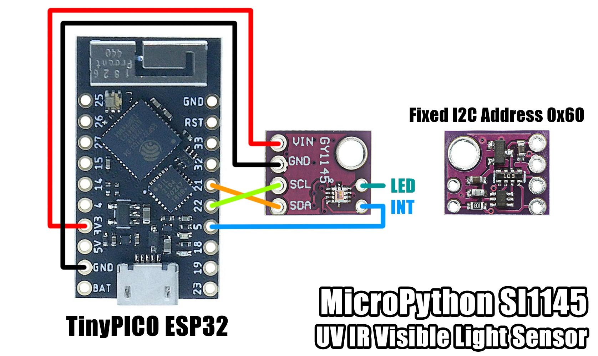

# MicroPython SI1145 UV IR Visible Light Sensor

A MicroPython library for the SiLabs SI1145 I2C UV IR Visible Light Sensor

## License

Licensed under the [MIT License](http://opensource.org/licenses/MIT).

Copyright (c) 2020 Mike Causer
